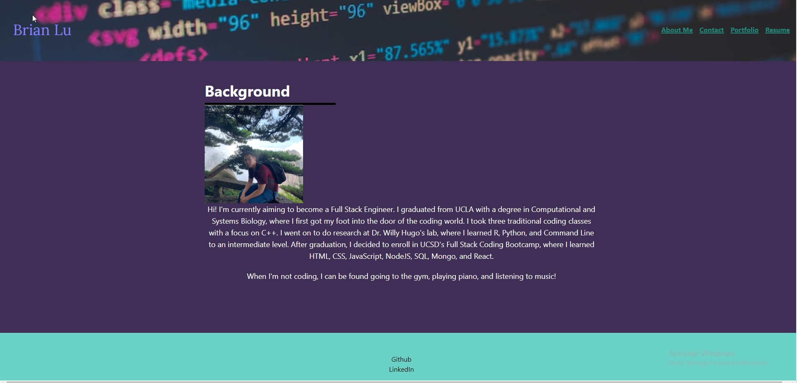

# React + Vite

This template provides a minimal setup to get React working in Vite with HMR and some ESLint rules.

Currently, two official plugins are available:

- [@vitejs/plugin-react](https://github.com/vitejs/vite-plugin-react/blob/main/packages/plugin-react/README.md) uses [Babel](https://babeljs.io/) for Fast Refresh
- [@vitejs/plugin-react-swc](https://github.com/vitejs/vite-plugin-react-swc) uses [SWC](https://swc.rs/) for Fast Refresh
# React-Portfolio

## Description

I built this project to display my skills and projects to future employers. This project not only shows my ability with React, but also links employers to other projects that I have worked on. This webpage also supplies my background information, ways to contact me, my portfolio, and my resume. I learned how to use React to design a single page application.

## Installation

N/A

## Usage

Simply follow the link to the deployed application.

Github Repository: https://github.com/brianlucla/React-Portfolio

Deployed Application: 

## Credits

I received help from my TA Sofia Tejada.

## License

Please refer to the license in the repository.
